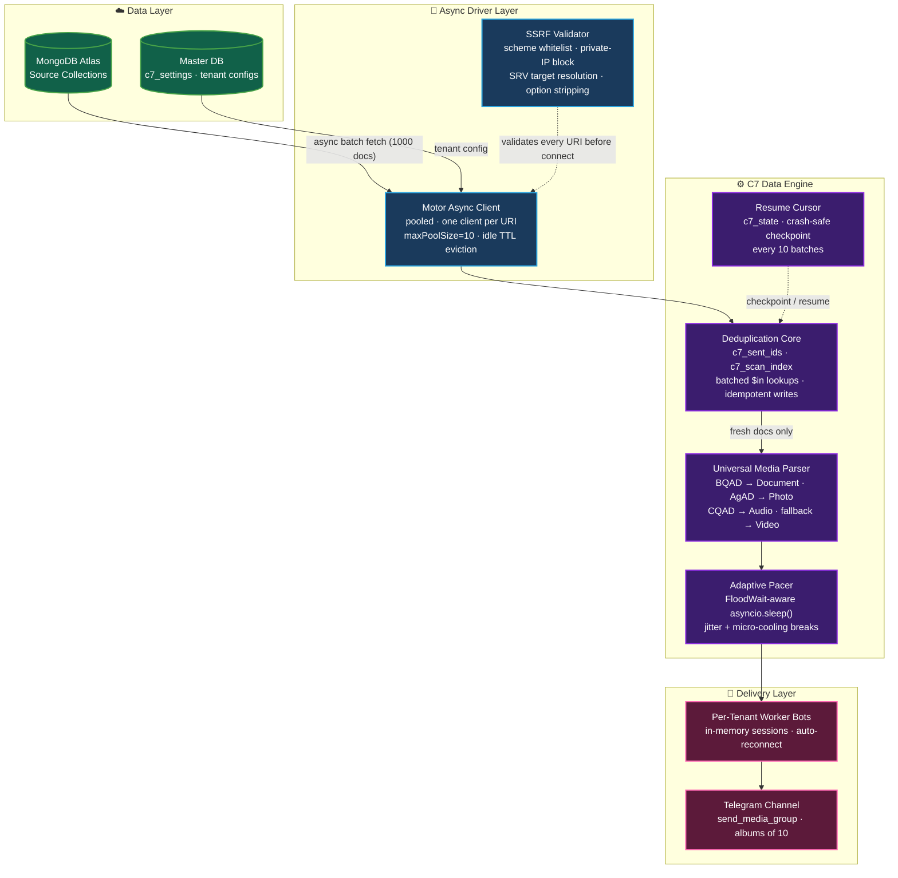

<div align="center">


<br>


</div>

<br>

## ⚡ Overview

**C7 MongoDB Transfer Bot V2.0** (internally, the C7 Data Engine) is a fully asynchronous, multi-tenant data pipeline that streams media catalogs from **MongoDB Atlas** into **Telegram channels** without touching raw file bytes.

The engine operates purely on Telegram `file_id` references: no downloads, no re-uploads, no disk I/O on the data path. A single deployed instance serves unlimited isolated tenants, each with their own credentials, database, worker bot, and transfer state — orchestrated over one shared asyncio event loop.

<br>

## 🏗️ Architecture



<br>

## 🔬 Engineering Deep-Dive

### 🎞️ Universal Media Parser
Modern Telegram `file_id` prefixes are not a reliable media-type signal. The engine therefore prefers the source record's `file_type`, then its MIME type, then legacy ID prefixes and filename extensions. It constructs the matching `InputMedia*` object without probing Telegram, while unknown records safely fall back to documents. This keeps modern movie-bot document albums on the fast batch path instead of forcing slow per-file retries.

### 🌊 Dynamic FloodWait Pacing
Every send path is wrapped in `FloodWait`-aware handling: the exact server-mandated backoff is honored via `asyncio.sleep(e.value)` — never a blocking sleep, so hundreds of concurrent tenant pipelines keep flowing while one waits. On repeated pressure the engine **permanently bumps its per-file delay** (capped at 6.0s), adds randomized jitter to break detectable patterns, and takes 30–60s micro-cooling breaks every 500 batches to protect account health.

### ☁️ Stateless Session Architecture
Every Pyrogram client runs with `in_memory=True` — **zero `.session` files touch disk**. Bot workers re-authenticate from tokens; the pre-scan userbot persists its session as a **Fernet-encrypted string** in MongoDB (`ENCRYPTION_KEY` env var — see setup below), so a leaked or compromised Master DB does not hand over a live Telegram account login. The result: the engine is fully stateless at the filesystem level, making it trivially deployable on ephemeral containers (Optiklink / Pterodactyl / any read-only-root host) and immune to session-file corruption on hard restarts.

### 🔁 Idempotent Delivery
A unique-indexed `c7_sent_ids` ledger plus a channel-history `c7_scan_index` make delivery idempotent across crashes, restarts, and manual re-runs. Dedup checks are **fully batched**: a single `$in` query per ledger clears an entire 1000-document fetch in one database round-trip, instead of two queries per file. Transfer progress and live-monitor resume tokens are stored in a host-owned runtime database, so the source catalogue can use a read-only MongoDB account. On boot, interrupted transfers trigger an interactive Continue / Start-Fresh prompt instead of blind auto-resume.

### 🛡️ SSRF-Hardened Multi-Tenancy
Every tenant-supplied MongoDB URI is X-rayed before a single socket opens: scheme whitelist, private/loopback/link-local IP rejection, real SRV-target resolution for `+srv` clusters, and stripping of dangerous driver options (`proxyHost`, `tlsInsecure`, pool overrides). Credentials are regex-redacted from every log line — Motor exceptions included.

### 🧵 Deterministic Concurrency
Per-tenant `asyncio.Lock` launch guards eliminate double-start races from rapid button taps. Every background coroutine is a **named, tracked `asyncio.Task`** with crash logging and a done-callback registry — shutdown cancels and awaits every in-flight task before closing pooled clients. No fire-and-forget, no orphaned coroutines.

<br>

## 🧰 Tech Stack

<div align="center">

[](https://skillicons.dev)

**Python 3.10 → 3.14** · **MongoDB Atlas + Motor** · **Pyrogram 2.0 + TgCrypto** · **aiohttp** · **Fernet (cryptography)**

</div>

<br>

## 📊 Pipeline Capabilities

| Capability | Implementation |
|---|---|
| 🧙 Zero-config onboarding | 7-step in-chat wizard with live credential validation |
| ⏸️ Pause / Resume / Stop | Non-blocking pause gate; cursor-safe at any point |
| 👁️ Real-time ingestion | MongoDB Change Streams monitor with resume tokens |
| 🔎 Channel pre-scan | Full history indexing to lock out duplicates pre-flight |
| 🎚️ Speed governor | Six presets (1.5s → 6.0s) adjustable mid-transfer |
| 🩺 Self-healing | Auto-reconnect, session refresh, webhook auto-clear on boot |
| 📈 Live telemetry | In-chat progress cards + color-coded structured console logs |
| 🏥 Health endpoint | Container-aware HTTP probe (`PORT`/`SERVER_PORT` binding) |

<br>

<details>
<summary><b>🕹️ Command Cheat-Sheet</b> — <i>click to expand</i></summary>
<br>

| Command | Action |
|---|---|
| `/start` | Live dashboard with tenant stats |
| `/setup` | Guided 7-step configuration wizard |
| `/transfer` | Launch the transfer pipeline |
| `/stop` | Graceful stop — cursor saved |
| `/monitor` | Start real-time Change Stream ingestion |
| `/stopmonitor` | Stop the live monitor |
| `/prescan` | Index target channel history for dedup |
| `/stats` | Totals: sent / remaining / cursor position |
| `/wipe` | Clear dedup ledger + scan index + cursor |
| `/config` | View current config (secrets masked) |

</details>

<details>
<summary><b>🚦 Getting It Running</b> — <i>click to expand</i></summary>
<br>

```bash
# 1. Clone
git clone <your-repo-url>
cd MongoDBTransferBot-main

# 2. Install
pip install -r requirements.txt

# 3. Configure — create .env in the project root
BOT_TOKEN=your_parent_bot_token
TELEGRAM_API_ID=your_api_id
TELEGRAM_API_HASH=your_api_hash
MONGO_URI=your_master_mongodb_uri
ADMIN_ID=your_telegram_user_id        # optional
STATE_MONGO_URI=your_runtime_mongodb_uri # optional; defaults to MONGO_URI
STATE_DB_PREFIX=c7_runtime               # optional
ENCRYPTION_KEY=your_fernet_key         # required only for /prescan — encrypts the
                                       # userbot session at rest (see below)

# 4. Launch
python mdb.py
```

The MongoDB URI entered in `/setup` is treated as a **read-only source
catalogue**. Mutable transfer ledgers, scan indexes, cursors, and live-monitor
resume tokens are written to the host-owned `STATE_MONGO_URI` instead. The
source documents may store Telegram IDs either as `_id` (legacy auto-filter
bots) or in a dedicated `file_id` field.

Then DM your bot `/start` on Telegram — the wizard handles everything else.

**Generating `ENCRYPTION_KEY`** (only needed if you plan to use `/prescan`):
```bash
python -c "from cryptography.fernet import Fernet; print(Fernet.generate_key().decode())"
```
Paste the output into `.env` as `ENCRYPTION_KEY=...`. Keep it secret and back it up — losing it means every previously-saved pre-scan session becomes undecryptable (the bot detects this automatically and just asks the user to log in again, it isn't fatal, but the old session is gone for good).

**Container hosts (Optiklink / Pterodactyl):** the health server auto-binds to the injected `PORT` / `SERVER_PORT` and degrades gracefully on bind failure. Startup command:

```bash
pip install --no-cache-dir -U pip && pip install --no-cache-dir -r requirements.txt && python3 mdb.py
```

</details>

<br>

<div align="center">

### ⚙️ Engineered for scale. Hardened by fire. Zero bytes touched.


</div>
